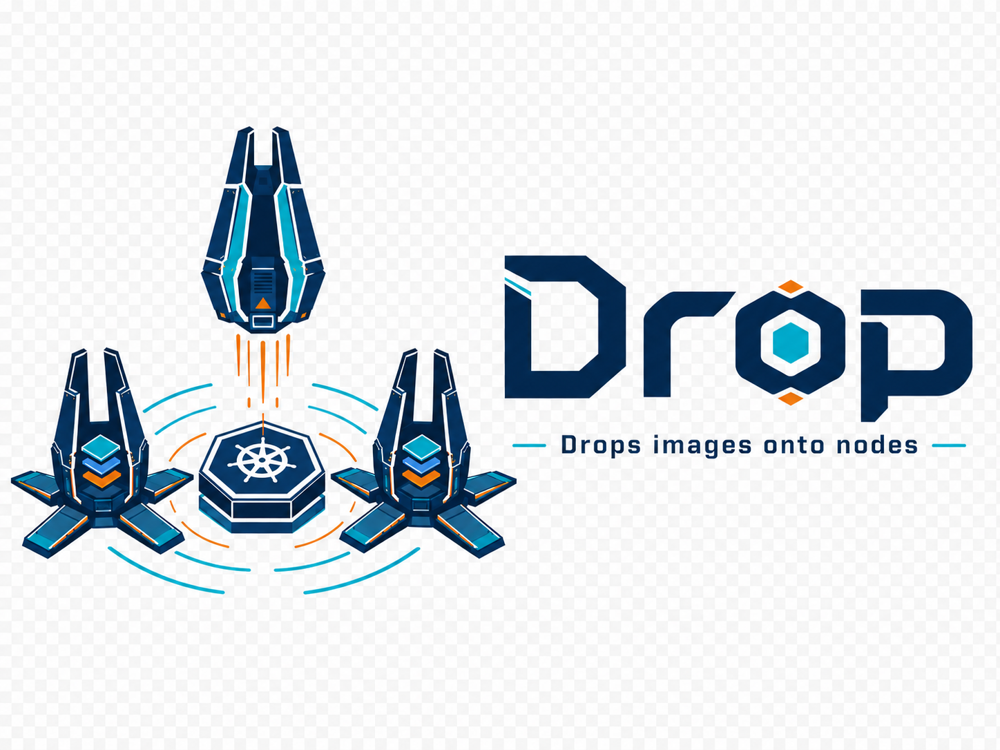

<p align="center">
  
</p>

<p align="center">
  <a href="https://github.com/Breee/drop/releases/latest"></a>
  <a href="https://github.com/Breee/drop/actions"></a>
  
</p>


A Kubernetes operator that pre-pulls container images onto nodes — safely, with pacing, and with automatic discovery. 

## Why

When many CI jobs or workloads start simultaneously, Kubernetes nodes face a thundering herd of image pulls. We hit this running large-scale GitLab CI — concurrent pods on the same node all pulling the same large image would saturate bandwidth, stall containerd, and cascade into failures.

**The problems:**

- **Thundering herd** — a spike of pods on one node triggers parallel pulls of the same image, saturating node bandwidth and destabilizing containerd.
- **Registry overload** — sudden pull surges hit registry rate limits or cause outages.
- **Cold-start latency** — large images take minutes to pull, delaying workloads that need them immediately.

**Drop's approach:** pre-cache images on nodes *before* workloads need them, pace pulls to stay within safe limits, and automatically discover which images matter most.

## What it does

- **Pre-caches images** on selected nodes before workloads need them
- **Discovers images** automatically from Prometheus metrics or OCI registries based on your criteria (e.g. top-pulled images)
- **Paces pulls** to avoid saturating node bandwidth or registry rate limits
- **Reports errors** using standard Kubernetes status patterns (`ErrImagePull`, `ConnectionRefused`, etc.)

## Discovery in 60 seconds

Drop Discovery is useful when image demand changes often and static image lists go stale. In fast-moving CI setups (for example with Renovate continuously landing new image versions), Prometheus-based discovery keeps your cache aligned with what jobs actually run. This is especially valuable when you rotate build nodes regularly (e.g. Cluster API MachineDeployments) — fresh nodes start with empty caches, and Discovery ensures the right images are pre-warmed immediately.

```yaml
apiVersion: drop.corewire.io/v1alpha1
kind: DiscoveryPolicy
metadata:
  name: popular-build-images
spec:
  syncInterval: 1h
  maxImages: 30
  sources:
    - type: prometheus
      prometheus:
        endpoint: https://mimir.example.com
        lookback: 168h        # 7 days — uses query_range and sums values
        step: 5m
        query: |
          count(
            container_memory_working_set_bytes{
              container!="",container!="POD",
              namespace="gitlab-runner",pod=~"runner-.*"
            }
          ) by (image)
```

Field guide:

- `syncInterval: 1h` → re-run discovery every hour.
- `maxImages: 30` → final cap: Drop keeps up to 30 images in `status.discoveredImages`.
- `lookback: 168h` → Drop queries Prometheus with `query_range` over the last 7 days and sums values per image to produce a usage score.
- `step: 5m` → resolution step for the range query (default).
- `namespace="gitlab-runner"` → only score images seen in CI runner jobs.
- `count(...) by (image)` → counts the number of running containers per image to rank by popularity.

Use it from a CachedImageSet:

```yaml
spec:
  discoveryPolicyRef:
    name: popular-build-images
```

See full discovery docs and examples: **[Discovery guide](https://breee.github.io/drop/docs/discovery/)**.

## Quick Start

```bash
# Install CRDs and operator via Helm
helm install drop charts/drop -n drop-system --create-namespace

# Cache a single image
kubectl apply -f - <<YAML
apiVersion: drop.corewire.io/v1alpha1
kind: CachedImage
metadata:
  name: nginx
spec:
  image: docker.io/library/nginx
  tag: 1.25-alpine
YAML

# Check status
kubectl get cachedimage nginx -o wide
```

## CRDs

All resources are **cluster-scoped** under `drop.corewire.io/v1alpha1`.

| Kind | Purpose |
|------|---------|
| `CachedImage` | Cache a single image on target nodes |
| `CachedImageSet` | Manage a group of images (static or from discovery) |
| `PullPolicy` | Shared pacing/safety config (concurrency, backoff) |
| `DiscoveryPolicy` | Auto-discover images from Prometheus or registries |

```
kubectl get drop          # shows all drop resources
kubectl get drop -o wide  # includes error messages
```

## Status at a glance

```
$ kubectl get cachedimages
NAME         IMAGE              TAG           STATUS             READY   AGE
nginx        docker.io/nginx    1.25-alpine   Cached             2/2     5m
broken-img   registry.bad/x     latest        ErrImagePull       0/2     2m
auth-fail    private.io/app     v1            ImagePullBackOff   0/1     3m

$ kubectl get cachedimagesets
NAME       STATUS      READY   MANAGED   SOURCE         AGE
dev-set    AllReady    3/3     3         dev-registry   1h
web-apps   Degraded    1/3     3                        10m

$ kubectl get discoverypolicies
NAME             STATUS              SOURCES   IMAGES   LASTSYNC   AGE
dev-registry     Synced              1         3        30s        1h
broken-prom      ConnectionRefused   1         0                   5m
bad-auth         Unauthorized        1         0                   2m
```

## Development

```bash
# Prerequisites: Go 1.23+, Kind, Tilt, Helm
make generate      # deepcopy
make manifests     # CRDs + RBAC
go build ./...     # compile

# Local dev loop (Kind + Tilt)
tilt up
```

## Docs

Full documentation at **[breee.github.io/drop/](https://breee.github.io/drop/)** (GitHub Pages).
