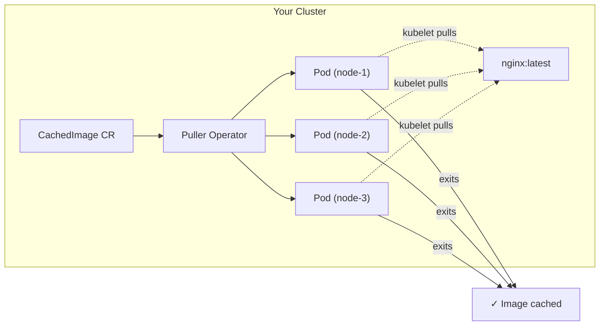
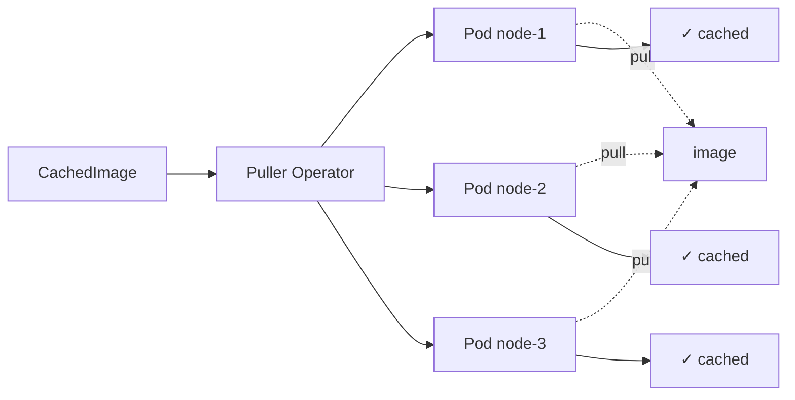

# Documentation Redesign Proposal

## Problem

Current landing page lists features nobody cares about until they already know the project. A visitor needs to answer two questions in <5 seconds:

1. **What does this do?** → A diagram worth 1000 words
2. **Where do I go?** → Depends on who I am

## Landing Page Design

### Hero: One Diagram



Below the diagram, one sentence:

> **Puller creates short-lived Pods on each node. The kubelet pulls the image, the Pod exits. No privileges, no DaemonSets.**

### Navigation: Three Personas

```
┌─────────────────────────────────────────────────────────┐
│                     I want to...                        │
├───────────────┬───────────────────┬─────────────────────┤
│  USE Puller   │  DEVELOP Puller   │  INTEGRATE (Agent)  │
│               │                   │                     │
│  • Install    │  • Architecture   │  • llms.txt         │
│  • Configure  │  • CRD Reference  │  • llms-full.txt    │
│  • Monitor    │  • Contributing   │  • Markdown API     │
│               │  • Testing        │  • Agent instruct.  │
└───────────────┴───────────────────┴─────────────────────┘
```

## Proposed Site Structure

```
/puller/                          ← Landing: diagram + persona links
/puller/docs/                     ← Docs index (short, links only)
/puller/docs/install/             ← Helm install, prerequisites
/puller/docs/usage/               ← CachedImage, CachedImageSet, PullPolicy examples
/puller/docs/discovery/           ← DiscoveryPolicy guide
/puller/docs/monitoring/          ← Metrics, events, dashboards
/puller/docs/reference/crds/      ← Generated field reference
/puller/docs/reference/errors/    ← Status conditions lookup
/puller/docs/reference/metrics/   ← Prometheus metrics table
/puller/docs/reference/arch/      ← Package graph, sequence diagrams
/puller/llms.txt                  ← Site index for AI agents (auto-generated by Hextra)
/puller/llms-full.txt             ← Complete reference in one file
```

### What changed vs. current

| Current | Proposed | Why |
|---------|----------|-----|
| `getting-started.md` (install + usage mixed) | Split into `install/` and `usage/` | Different questions at different times |
| `observability.md` | `monitoring/` | Clearer name |
| `kamera.md` at top level | Remove from docs (it's a future evaluation, not user-facing) | Noise |
| 6 feature cards on homepage | 1 diagram + 3 persona links | Shows vs. tells |
| `_generated_crds` URLs | `reference/crds/` (aliases already done) | Clean |

## Landing Page Content (Markdown)

```markdown
---
title: Puller
layout: hextra-home
---

<div class="hx-mt-6 hx-mb-6">

  Puller

</div>

<div class="hx-mb-8">

  Pre-cache container images on Kubernetes nodes.

</div>

<!-- Mermaid diagram rendered inline -->


> Create a CachedImage CR → operator creates a Pod per node → kubelet pulls the image → Pod exits → image is warm on every node. No privileges required.

---

## I want to...


  
  
  

```

## Sidebar Navigation (proposed)

```yaml
# Weight ordering in frontmatter
docs/_index.md         # weight: 0 — just links, no prose
docs/install.md        # weight: 1 — prerequisites + helm
docs/usage.md          # weight: 2 — CachedImage, CachedImageSet, PullPolicy examples
docs/discovery.md      # weight: 3 — DiscoveryPolicy
docs/monitoring.md     # weight: 4 — metrics, events, conditions
docs/reference/_index  # weight: 5 — section header
docs/reference/crds    # weight: 1 — generated
docs/reference/errors  # weight: 2 — generated
docs/reference/metrics # weight: 3 — generated
docs/reference/arch    # weight: 4 — generated
```

## Key Principles

1. **Diagram first** — one image that shows the mechanism. No "features" list.
2. **Persona routing** — 3 cards that route you based on intent, not topic.
3. **Flat + shallow** — max 2 levels deep. Everything reachable in 2 clicks.
4. **No noise** — Kamera (future), AI-friendliness meta-docs don't belong in user docs.
5. **Examples everywhere** — every CRD page starts with a working YAML before the field table.
6. **One file for agents** — `llms-full.txt` served on the site = entire project context in one GET.

## Implementation Steps

1. [ ] Create the Mermaid diagram as an SVG (for the landing page image fallback)
2. [ ] Rewrite `_index.md` (landing) with diagram + persona cards
3. [ ] Split `getting-started.md` → `install.md` + `usage.md`
4. [ ] Rename `observability.md` → `monitoring.md`
5. [ ] Remove `kamera.md` from docs (move to ai-docs/ or a "future" section)
6. [ ] Update sidebar weights
7. [ ] Verify all links resolve with Hugo aliases
8. [ ] Run `make docs-gen` to regenerate with new structure

## Gaps / Open Questions

### 1. Mermaid in hextra-home layout
Hextra's `hextra-home` layout may not process Mermaid code fences the same as regular content pages. Options:
- Use `` shortcode (if Hextra supports it in that layout)
- Pre-render as SVG and embed as `` (guaranteed to work, also better for llms.txt/markdown output)
- **Recommendation:** Pre-render SVG, store in `docs/static/img/how-it-works.svg`

### 2. "Develop Puller" has no landing page
The persona card links to `reference/arch/` but a developer first needs: clone → install tools → run tests → submit PR. Options:
- Add `docs/contributing.md` (build from source, dev workflow, test commands)
- Or link to CONTRIBUTING.md in the repo (GitHub renders it)
- **Recommendation:** Add a short `docs/developing.md` that covers `make codegen && make test && make lint`

### 3. Redirects for renamed pages
Renaming `getting-started` → `install` + `usage` and `observability` → `monitoring` breaks existing links (README, external blogs, bookmarks). Need Hugo `aliases` in OLD paths pointing to NEW:
```yaml
# In install.md
aliases:
  - /puller/docs/getting-started/
```

### 4. llms.txt template hardcodes old paths
The repo-root `llms.txt` template in `templates.go` has:
```
| [Getting Started](docs/getting-started/) | ... |
| [CRD Reference](docs/reference/_generated_crds/) | ... |
```
These need to update to the new paths after restructuring.

### 5. "Feed to AI Agent" card links to raw file
`llms-full.txt` is plain text — clicking it just dumps text in the browser. Better options:
- Link to a dedicated `docs/for-agents.md` page explaining the endpoints
- Or keep it (agents don't click HTML links — they fetch URLs, and this is the right one)
- **Recommendation:** Keep as-is. The card subtitle already explains what it is. Humans who click it see exactly what an agent sees — that's the point.

### 6. docs/_index.md purpose
Currently has "Core Concepts" and "How It Works" — content that overlaps with the landing page diagram. After redesign:
- Make it a pure navigation hub: short intro sentence + auto-generated section list
- The "how it works" explanation lives on the landing page diagram only
- Core concepts (CRD list) moves to `usage.md`

### 7. Missing llmsDescription for new pages
Every new/renamed page needs `llmsDescription` frontmatter:
- `install.md` — "Helm install, prerequisites, namespace setup"
- `usage.md` — "CachedImage, CachedImageSet, PullPolicy examples with YAML"
- `monitoring.md` — "Prometheus metrics, events, status conditions, Grafana"
- `developing.md` — "Build, test, lint, codegen commands for contributors"

### 8. Search index
Hextra FlexSearch indexes page content automatically. Renaming files doesn't break it — Hugo rebuilds the index. No action needed, but verify after implementation.

### 9. Diagram for AI agents
The Mermaid diagram is great for humans but invisible to agents reading markdown output. The one-line description below it is what agents actually consume. Make sure the alt-text / description is sufficient:
> "CachedImage CR → Puller Operator → Pod per node → kubelet pulls image → Pod exits → image cached"

This should appear in the page's `llmsDescription` frontmatter.
