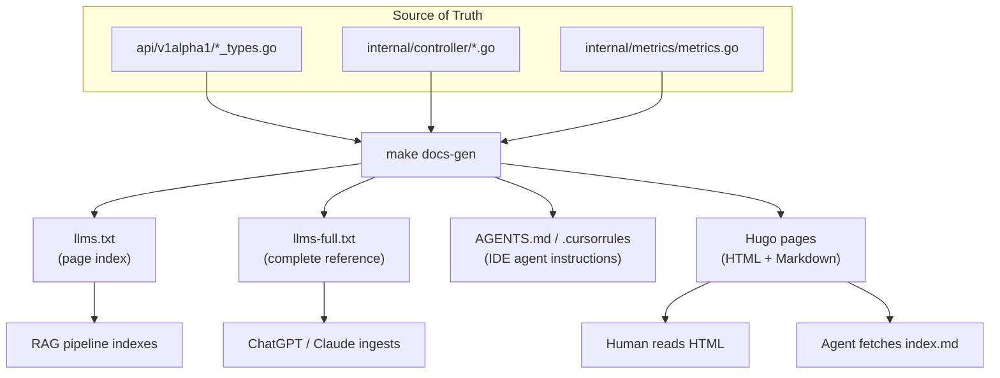

## Endpoints

| URL | Content | Use case |
|-----|---------|----------|
| [`/drop/llms.txt`](/drop/llms.txt) | Page index with one-line summaries | Discover what's available |
| [`/drop/llms-full.txt`](/drop/llms-full.txt) | Complete CRD reference, all fields | One GET = full project context |
| `{any-page}/index.md` | Clean Markdown (no HTML, no frontmatter) | Fetch individual pages |

## How It Works

All documentation is generated from one source of truth:



Three audiences, same facts:

| Audience | What they consume |
|----------|-------------------|
| **USE agents** (ChatGPT, Claude, RAG) | `llms.txt`, `llms-full.txt`, `{page}/index.md` |
| **CODE agents** (Copilot, Cursor) | `.github/copilot-instructions.md`, `.cursorrules`, `AGENTS.md` |
| **Humans** | This Hugo site (HTML with search, nav, diagrams) |

## Markdown Output

Every page on this site is available as clean Markdown. Append `index.md` to any URL:

```
https://your-site.io/drop/docs/install/          → HTML
https://your-site.io/drop/docs/install/index.md   → Markdown
```

The HTML head includes a `<link rel="alternate">` tag pointing to the Markdown variant:

```html
<link href="/drop/docs/install/index.md" rel="alternate" type="text/markdown" title="Installation" />
```

## llms.txt

Auto-generated by Hextra from page frontmatter. Lists every page with its `llmsDescription`:

```
# Drop Operator
> Kubernetes operator that caches container images on cluster nodes.

## Documentation
- [Installation](http://...): Install via Helm. Requires K8s 1.28+...
- [Usage](http://...): CachedImage, CachedImageSet, PullPolicy examples...
...
```

## llms-full.txt

Static file with the complete CRD field reference — every field, type, default, enum, and status condition in one document. Suitable for:
- Pasting into ChatGPT/Claude as project context
- RAG indexing
- Agent tools that accept a URL to read

## IDE Agent Instructions

Files in the repo root that IDE agents auto-discover:

| File | Agent |
|------|-------|
| `.github/copilot-instructions.md` | GitHub Copilot |
| `.cursorrules` | Cursor |
| `AGENTS.md` | Codex, Devin, generic agents |

All generated from the same source. Contains: build commands, conventions, CRD→controller mapping, don'ts.

## Context Menu

Every doc page has a context menu (top-right) with:
- **Copy as Markdown** — copies the page content
- **Open in ChatGPT** — opens ChatGPT with the Markdown URL pre-loaded
- **Open in Claude** — opens Claude with the Markdown URL pre-loaded

## Generating Docs

```bash
make docs-gen    # regenerate everything from source
```

This runs `go run ./hack/gen-ai-docs/` which:
1. Parses Go types, controller code, metrics registration
2. Builds a `knowledge.yaml` intermediate representation
3. Renders templates for all output formats

Adding a new output format = adding one template to `hack/gen-ai-docs/templates.go`.
