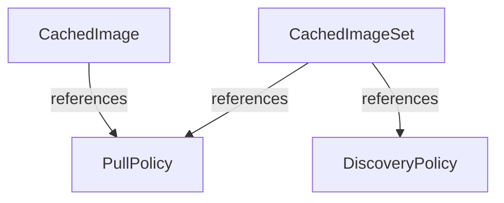
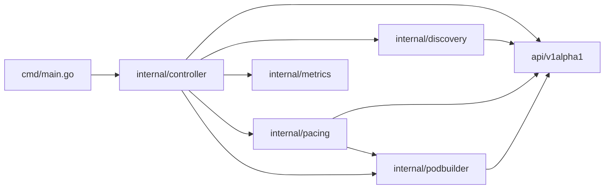
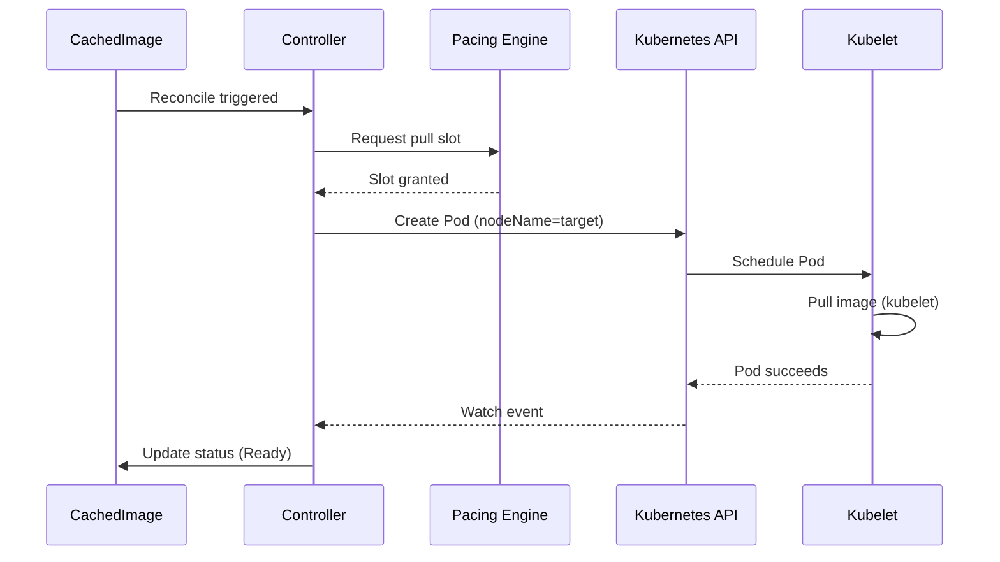

---
# Generated by make docs-gen — DO NOT EDIT
title: Architecture
weight: 4
aliases:
  - /drop/docs/reference/architecture/
description: Internal architecture and package dependency graph.
llmsDescription: |
  Package dependency graph and CRD ownership relationships for the drop
  operator. Shows how controllers, pacing engine, pod builder, and discovery
  packages relate. Useful for understanding code navigation and import paths.
---

## CRD Relationships

## Package Dependencies

## Reconciler → CRD Mapping

| CRD | Controller | Dependencies |
|-----|-----------|--------------|
| CachedImage | `internal/controller/cachedimage_controller.go` | podbuilder, pacing, metrics |
| CachedImageSet | `internal/controller/cachedimageset_controller.go` | podbuilder, pacing, metrics |
| DiscoveryPolicy | `internal/controller/discoverypolicy_controller.go` | podbuilder, pacing, metrics |
| PullPolicy | (config-only) |  |

## Pull Mechanism

