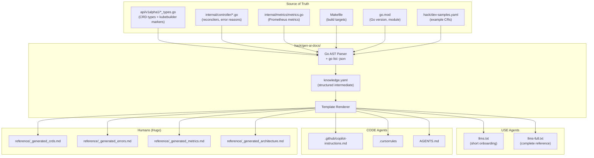
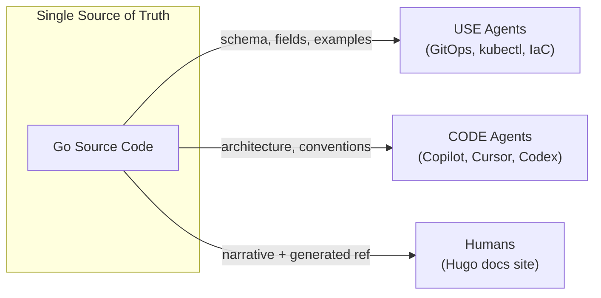

# Documentation Generation

<!-- Generated by make docs-gen — DO NOT EDIT -->

## How It Works

All documentation is generated from source code via `make docs-gen` (which runs `go run ./hack/gen-ai-docs/`).

## Three Audiences

## Commands

| Command | Purpose |
|---------|---------|
| `make docs-gen` | Regenerate all docs from source |
| `make docs-gen-check` | CI gate — fails if docs are stale |
| `make codegen` | CRDs + deepcopy + docs (full pipeline) |
